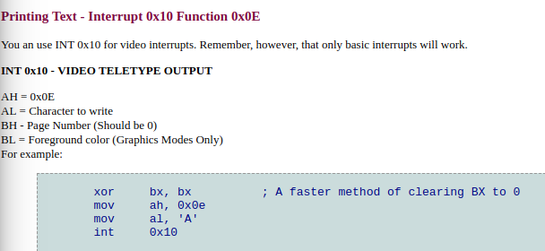

# important notes regarding the bootloader 

## 8086 architecture and future implications of its designs

- 16 bit processor 
    - at the time 64k ram was not enough so segment:offset memory mode was born
- 4 registers refer to segment base address
    - CS (code segment)
    - DS (Data segment)
    - ES (EXTRA segment)
    - SS (stack segment)
- with this scheme an address is resolved into SEGMENT * 16 + 0ffset resulting in a 20 bit address space offering 1 mb of ram
- processors boot with this scheme enabled by default for back compatibility and bios functions are only accessible from the real mode
- real mode doesn't offer virtual memory or memory protection
- bios offers wide variety of routines such as 
    - printing to display
    - reading from storage devices
    - checking available ram

## Bios character print routine

